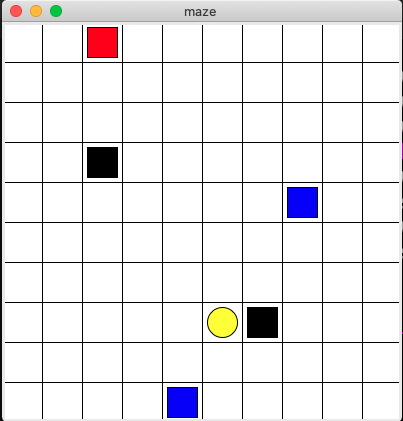
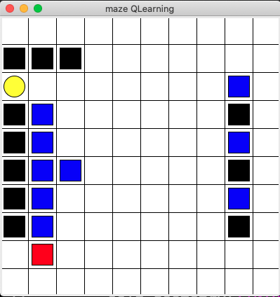
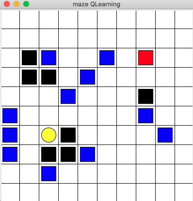
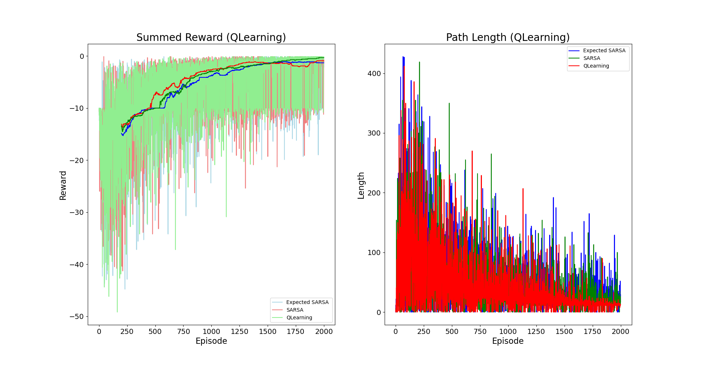

# Maze World - Assignment 2
Assignment code for course ECE 457C at the University of Waterloo in Spring 2022.

**Due Date:** *July 17*, 2021 by 11:59pm submitted as a PDF report submitted to Crowdmark (link will be emailed) and code submitted to the LEARN dropbox for your group.

**Collaboration:** You can discuss solutions and help to work out the code. But the work of the assignemnt must be done either *alone* or in a group of just *two people*. All code and writing will be cross-checked against each other and against internet databases for cheating. Some components of the solution will be graded automatically, so make sure to adhere to the given API. If you are doing the assignment alone, you still need to join a group on LEARN in order to get a dropbox. If you are working with a partner then you need to sign up for a group on LEARN and Crowdmark to link your submissions.

Updates to code which will be useful for all or bugs in the provided code will be updated on gitlab and announced.

## Domain Description - GridWorld

The domain consists of a 10x10 grid of cells. The agent being controlled is represented as a red square. The goal is a yellow oval and you receive a reward of 1 for reaching it, this ends and resets the episode.
Blue squares are **pits** which yield a penalty of -10 and end the episode. 
Black squares are **walls** which cannot be passed through. If the agent tries to walk into a wall they will remain in their current position and receive a penalty of -.3. Apart from these, the agent will receive a -0.1 for reaching any other cell in the grid since the objective is to move to the goal state as quickly as possible.
There are **three tasks** defined in `run_main.py` which can be commented out to try each. They include a combination of pillars, rooms, pits and obstacles. The aim is to learn a policy that maximizes expected reward and reaches the goal as quickly as possible. You can set the taskNum variable for each task to change which one is beined learned.

  

### First Demo Experiment 

Each combination of RL Algorithm and environment parameters constitutes an experiment that we will run for a number episodes, restarting the environment again each episode but keeping the value function learned so far.
You can add a new entry for each experiment in the experiments list and then they will all plot side-by-side at the end.

## Assignment Requirements

This assignment will have a written component and a programming component.
Clone the mazeworld environment locally and run the code looking at the implementation of the sample algorithm.
For each of the following four algorithms you will implement them using the corresponding skeleton code, and provide a breif report on the problem and the results. 
1. SARSA
    - code: **(15%)** Implement SARSA (`RL_brainsample_sarsa.py`)
    - report: **(10%)** Report on definition, design and results.
2. QLearning
    - code: **(15%)** Implement QLearning (`RL_brainsample_qlearning.py`)
    - report: **(10%)** Report on definition, design and results.
3. Expected SARSA
    - code: **(15%)** Implement Expected SARSA (`RL_brainsample_expsarsa.py`)
    - report: **(10%)** Report on definition, design and results.
4. Double QLearning
    - code: **(15%)** Implement Double QLearning (`RL_brainsample_doubqlearning.py`)
    - report: **(10%)** Report on definition, design and results.

### Report Details

The report should be submited on to Crowdmark as a pdf: 
- Describing each algorithm you used, define the states, actions, dynamics. Define the mathematical formulation of your algorithm, show the Bellman updates you use. If there is some additional functions you needed to add, explain them briefly in the report. If you made any adjustments to the representation of states or actions for you local code, explain what you did.
- Some quantitative analysis of the results, a default plot for comparing all algorithms is given. You can create more plots showing different analysis if you want to. Make sure plots are all labelled fully (axis, title, legend for all lines etc). 
- Some qualitative analysis of you observations where one algorithm works well in each case, what you noticed along the way, explain the differences in performance related to the algorithms.

### Evaluation

You will also submit your code to LEARN and grading will be carried out using a combination of automated and manual grading.
Your algorithms should follow the pattern of the `RL_brain.py`, which is duplicated in each of the particular algorithm files. The file `RL_brainsample_hacky_PI.py` gives a bad implementation of a Policy-Iteration-style algorithm to give you an idea how things work.
We will look at your definition and implmentation which should match the description in the document.
We will also automatically run your code on the given domain on the three tasks defined in `run_main.py` as well as other maps you have not seen in order to evaluate it. 
Part of your grade will come from the overall performance of your algorithm on each domain.
So make sure your code runs with the given unmodified `maze_env` code if we import your class names.

### Code Suggestions
- All skeleton files define the same class `rlalgorithm`. Do not change this name.
- Feel free to change the `__init__` to include your desired parameters. Do not change the *signature* for `choose_action` and `learn`.
- Feel free to add needed methods to the class.
- The central elements you need to create are:
  - The representation of the value function Q(S,A), this should be some kind of lookup table. You could use a Python dictionary, adding new states as they are encountered, then updating them, or a tabular form like a Pandas DataFrame, or something else. *Don't use a neural network or state approximation scheme* for now, just store the expected, discounted value for a state, action pair *explicitly* in a fast datastructure.
  - The Bellman Equation should be implemented inside the `learn(s, a, r, s_)` function in some manner that combines the information you have from the function parameters to update your representation of the value function Q(S,A).
  - The `choose_action` function performance $\epsilon$-*greedy* action selection using the current Q(S,A) estimate.

- When the number of episodes ends, a plot is displayed of the algorithm performance. If multiple algorithms are run at once then they will be all plotted together for comparison. You may modify the plotting code and add any other analysis you need, this is only a starting point.
- There are a number of parameters defined in `run_main` that can be used to speed up the simulations. The `DEBUG` global variable adjusts what level of details is printed to screen during training, a higher number could help you see what's happening, but slow down training. Once you have debugged an algorithm and see it is running you can alter the `sim_speed`, `printEveryNth` and `renderEveryNth` variables to alter the speed of each step and how often data is printed or updated visually in order to speed up training. 
- the `window` variable defines how median summed reward averaging is shown. After your algorithm has reached more than `window` trainining episodes, the code in `run_main.py` will begin saving the median and variance for the summed total reward received over the previous `window` episodes. So if you set it to 100 and run 500 episodes, from ep 101 to 500 there will be a new line on your plot shown the median summed reward per episode. This is a more stable line that lets you see the trend better and smooths away all of the noise arising from the random luck of each particular episode.
- For the default algorithms we have implemented on these domains it seems to take at least 1500 episodes to converge, so don't read too much into how it looks after a few hundred. The Path Length plot shows the total number of steps it took the algorithm to reach the goal in that episode. It is very related to the total summed reward from an episode but is also a concrete measure that is a bit more interpretable for us. Are there any other metrics you could plot that could help understand better what happened? How about the number of times it fell in a pit, or hit the edge of the Maze?

### Plot: 2000 episodes on Task 2 comparing Qlearning, SARSA, ExpectedSARSA

